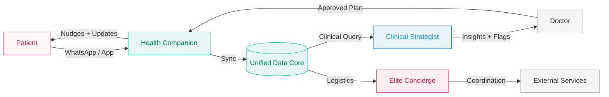

<!-- SLIDE 1: Cover -->

  LONGEVITY CLINIC &nbsp;·&nbsp; MULTI-AGENT AI SYSTEM

<h1 style="font-family:'Playfair Display',serif;font-size:3.8rem;font-weight:900;color:#1a1a1a;line-height:1.05;margin-bottom:1rem;">
  The Health <em style="color:#ef406b;font-style:normal;">Chief of Staff</em>
</h1>

  רשת סוכני AI הוליסטית לחוויית בריאות ללא חיכוך

  לאלפיון העליון &nbsp;·&nbsp; Zero Friction Experience

---
layout: default
---

<!-- SLIDE 2: Vision -->

החזון

<h2 class="slide-title">מרפאת לונגבטי לאלפיון העליון</h2>

הסטנדרט אינו רק "מתקדם" — הוא "בלתי מורגש"

  

    
⏱️

    
זמן

    
המשאב היקר ביותר — לא בזבז אפילו שנייה אחת

  

  

    
🔒

    
פרטיות

    
ערך עליון — VIP Standard מוחלט

  

  

    
🎯

    
דיוק

    
Hyper-Personalization — כל החלטה מבוססת נתונים

  

  

    המערכת הופכת את המרפאה מ<strong style="color:#ef406b;">"ספקית שירות"</strong> ל<strong style="color:#00C49A;">"נאמן הבריאות המרכזי"</strong> של המטופל
  

---
layout: default
---

<!-- SLIDE 3: Architecture -->

ארכיטקטורה

<h2 class="slide-title">Unified Data Core</h2>

מאגר נתונים אחוד — ליבת המערכת

  

    
🧠

    
Unified Data Core

    
Health Chief of Staff

    

      
Labs + Genetics

      
Wearables

      
External Docs

    

  

  

    

      🩺
      

        
Clinical Strategist

        
עוזר רופא · ניתוח קליני · RAG Query

      

    

    

      🤵
      

        
Elite Concierge

        
עוזר תפעולי · לוגיסטיקה · שרשרת ערך

      

    

    

      🤝
      

        
Health Companion

        
ליווי מטופל · Contextual Nudging · The Vault

      

    

  

---
layout: default
---

<!-- SLIDE 4: Mermaid -->

זרימת מידע

<h2 style="font-family:'Playfair Display',serif;font-size:2rem;color:#1a1a1a;margin-bottom:1rem;">Multi-Agent Flow</h2>

---
layout: default
---

<!-- SLIDE 5: Clinical Strategist -->

ערוץ א׳ — קליני

  

    <h2 class="slide-title">Clinical Strategist</h2>
    
עוזר הרופא — מכפיל כוח קליני

    

      

        אינטגרציה
        
איסוף והצלבת נתוני מעבדה, בדיקות, גנטיקה, אפיגנטיקה ו-Wearables לתמונת מצב אחת

      

      

        דאשבורד
        
הצפת Anomalies וקורלציות בזמן אמת — הדגל האדום עולה לפני שהרופא מחפש

      

      

        Query Bar
        
ממשק RAG — הרופא שואל בשפה חופשית על היסטוריית המטופל ומקבל תשובות מגובות Citations

      

    

  

  

    
דוגמאות משימות

    <ul style="list-style:none;padding:0;margin:0;display:flex;flex-direction:column;gap:0.65rem;">
      <li style="color:#333;font-size:0.83rem;line-height:1.4;padding-right:0.7rem;border-right:3px solid #1A8FBF;">סיכום קליני לרופא + דגלים אדומים</li>
      <li style="color:#333;font-size:0.83rem;line-height:1.4;padding-right:0.7rem;border-right:3px solid #1A8FBF;">הכנת מפגש שיקוף תוצאות</li>
      <li style="color:#333;font-size:0.83rem;line-height:1.4;padding-right:0.7rem;border-right:3px solid #1A8FBF;">איסוף מידע יזום טרום ביקור</li>
      <li style="color:#333;font-size:0.83rem;line-height:1.4;padding-right:0.7rem;border-right:3px solid #1A8FBF;">תחקור בשיח חופשי על המטופל</li>
    </ul>
  

---
layout: default
---

<!-- SLIDE 6: Elite Concierge -->

ערוץ ב׳ — תפעולי

  

    <h2 class="slide-title">Elite Concierge</h2>
    
לוגיסטיקה חרישית — הכול קורה מאחורי הקלעים

    

      

        לוגיסטיקה
        
ניהול אוטונומי של תיאום בדיקות דם בבית, משלוחי תוספים וסנכרון יומנים — ישירות מול עוזרי המטופל

      

      

        מלאי
        
מעקב שרשרת ערך — תוספים, חיישני CGM — הכול מנוטר ומוזמן מחדש אוטומטית

      

      

        תזמון
        
תזכורות חכמות לביצוע בדיקות + עדכון על בדיקות שלא בוצעו ללא מעורבות המטופל

      

    

  

  

    
ה-VIP Experience

    
המטופל לא יודע שכלום קורה — הוא רק מרגיש שהכול

    
פשוט עובד.

    

      ✈️ "ראיתי שאתה טס לחו"ל — סידרתי מלאי תוספים למסע"
    

  

---
layout: default
---

<!-- SLIDE 7: Health Companion -->

ערוץ ג׳ — ליווי

  

    <h2 class="slide-title">Health Companion</h2>
    
שותף לדרך — 24/7 בלי להרגיש "נרדף"

    

      

        הנגשה
        
תרגום תוצאות בדיקות מקליני לפשוט — "מה משמעות תוצאות המעבדה עבורי?"

      

      

        Nudging
        
תזכורות מבוססות מצב פיזיולוגי — "השינה שלך הייתה קטועה, כדאי להקדים מגנזיום"

      

      

        The Vault
        
קליטת ייעוצים ומסמכים חיצוניים ואינטגרציה שלהם בתוכנית הטיפול הכוללת

      

    

  

  

    
ערוץ תקשורת

    

      
💬

      
WhatsApp

      
+ Dashboard מלא לרופא ולאדמין

    

    

      🗣️ תשאול חופשי בשפה טבעית — המטופל שואל, המערכת עונה
    

  

---
layout: default
---

<!-- SLIDE 8: Patient Journey -->

מסע המטופל

<h2 class="slide-title">Human-AI Synergy</h2>

AI מתאם — אנשים מבצעים — מטופל חווה

  

    
Onboarding

    
📋

    
שאלונים אדפטיביים מונחי AI

  

  
▶

  

    
Diagnostics

    
🧪

    
בדיקות דם, DEXA, VO2 Max

  

  
▶

  

    
Synthesis

    
⚗️

    
רופא + AI מגבשים פרוטוקול

  

  
▶

  

    
Continuous Care

    
🔄

    
ליווי יומיומי — צוות + AI

  

  
▶

  

    
Review

    
📊

    
שיקוף מגמות רבעוני

  

  
    Digital Twin — סימולציות עבור הרופא והמטופל על בסיס כל המידע המצטבר
  

---
layout: default
---

<!-- SLIDE 9: Strategic Principles -->

עקרונות ליישום

<h2 class="slide-title">דגשים אסטרטגיים</h2>

  

    

      🔐
      פרטיות VIP Standard
    

    
מודלי שפה בסביבות ענן סגורות (VPC), ללא אימון על נתוני לקוחות, הצפנה מקצה לקצה

  

  

    

      📚
      Explainability
    

    
כל המלצה קלינית מגובה במקור מדעי (Citations) — הרופא מאשר מהר, בבטחה

  

  

    

      👨‍⚕️
      Human-in-the-Loop
    

    
כל המלצה רפואית עוברת אישור מהיר של הגורם האנושי לפני הנגשתה למטופל

  

  

    

      🎯
      Hyper-Personalization
    

    
ה-AI לומד העדפות, טון ואורח חיים — ומשתלב כחלק בלתי נפרד מיומו של המטופל

  

---
layout: default
---

<!-- SLIDE 10: Market -->

פוטנציאל שוק

<h2 class="slide-title">מעבר למרפאת הלונגבטי</h2>

תשתית הסוכנים ניתנת לפריסה בכל מסגרת בריאות

  

    
🏥 רופא משפחה פרטי

    
אותה רשת סוכנים בקשר בין מטופל לרופא המשפחה — עם התאמות קלות

  

  

    
🏢 ארגוני בריאות

    
תשתית Longevity-focused agents לכל ארגון בריאות

  

  
דוגמאות ליכולות הסוכנים

  

    
איסוף תוצאות + עדכון גיליון רפואי

    
הנגשת מושגים קליניים לשפה מובנת

    
תיאום חכם לפי זמינות ביומן

    
ניהול מלאי תוספים + הזמנה אוטומטית

    
Behavioral Nudging מבוסס הקשר

    
איסוף דיווחים סובייקטיביים שוטפים

  

---
layout: default
class: text-center
---

<!-- SLIDE 11: Closing -->

  LONGEVITY CLINIC &nbsp;·&nbsp; THE FUTURE OF CARE

<h2 style="font-family:'Playfair Display',serif;font-size:2.9rem;font-weight:900;color:#1a1a1a;line-height:1.15;margin-bottom:1.2rem;">
  ה-AI הוא לא תחליף לרופא — 
  <em style="color:#ef406b;font-style:normal;">הוא "מכפיל כוח"</em>
</h2>

  תחושת ליווי של 24/7 — מבלי להרגיש "נרדף" על ידי אפליקציה, 
  אלא נתמך על ידי שותף לדרך

  Zero Friction
  ·
  Health Trustee
  ·
  Digital Twin

