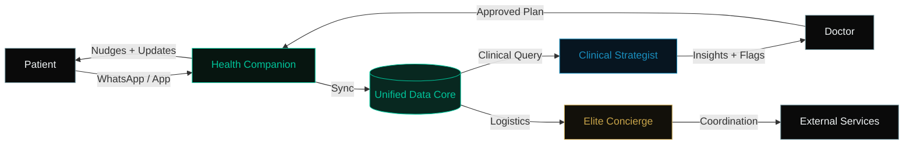

  
  

  

  
LONGEVITY CLINIC &nbsp;·&nbsp; MULTI-AGENT AI SYSTEM

  <h1 style="font-family:'Playfair Display',serif;font-size:3.6rem;font-weight:900;color:#EEF2F3;line-height:1.08;margin-bottom:1.2rem;text-shadow:0 2px 30px rgba(0,0,0,0.8);">
    The Health Chief of Staff
  </h1>

  

  

    רשת סוכני AI הוליסטית לחוויית בריאות ללא חיכוך
  

  
לאלפיון העליון &nbsp;·&nbsp; Zero Friction Experience

---
layout: default
background: '#040B0D'
---

החזון

<h2 style="font-family:'Playfair Display',serif;font-size:2.4rem;color:#EEF2F3;margin-bottom:0.5rem;line-height:1.2;">מרפאת לונגבטי לאלפיון העליון</h2>

הסטנדרט אינו רק "מתקדם" — הוא "בלתי מורגש"

  

    
⏱️

    
זמן

    
המשאב היקר ביותר — לא בזבז אפילו שנייה אחת

  

  

    
🔒

    
פרטיות

    
ערך עליון — VIP Standard מוחלט

  

  

    
🎯

    
דיוק

    
Hyper-Personalization — כל החלטה מבוססת נתונים

  

  
המערכת הופכת את המרפאה מ"ספקית שירות" ל"נאמן הבריאות המרכזי" של המטופל

---
layout: default
background: '#040B0D'
---

ארכיטקטורה

<h2 style="font-family:'Playfair Display',serif;font-size:2.2rem;color:#EEF2F3;margin-bottom:0.4rem;">Unified Data Core</h2>

מאגר נתונים אחוד — ליבת המערכת

  

    
🧠

    
Unified Data Core

    
Health Chief of Staff

    

      
Labs + Genetics

      
Wearables

      
External Docs

    

  

  

    

      
🩺

      

        
Clinical Strategist

        
עוזר רופא · ניתוח קליני · RAG Query

      

    

    

      
🤵

      

        
Elite Concierge

        
עוזר תפעולי · לוגיסטיקה · שרשרת ערך

      

    

    

      
🤝

      

        
Health Companion

        
ליווי מטופל · Contextual Nudging · The Vault

      

    

  

---
layout: default
background: '#040B0D'
---

זרימת מידע — ארכיטקטורה

<h2 style="font-family:'Playfair Display',serif;font-size:2rem;color:#EEF2F3;margin-bottom:1.5rem;">Multi-Agent Flow</h2>

---
layout: default
background: '#040B0D'
---

ערוץ א׳ — קליני

  

    <h2 style="font-family:'Playfair Display',serif;font-size:2.2rem;color:#EEF2F3;margin-bottom:0.4rem;">Clinical Strategist</h2>
    
עוזר הרופא — מכפיל כוח קליני

    

      

        
אינטגרציה

        
איסוף והצלבת נתוני מעבדה, בדיקות, גנטיקה, אפיגנטיקה ו-Wearables לתמונת מצב אחת

      

      

        
דאשבורד

        
הצפת Anomalies וקורלציות בזמן אמת — הדגל האדום עולה לפני שהרופא מחפש

      

      

        
Query Bar

        
ממשק RAG — הרופא שואל בשפה חופשית על היסטוריית המטופל ומקבל תשובות מגובות Citations

      

    

  

  

    
דוגמאות משימות

    <ul style="list-style:none;padding:0;margin:0;display:flex;flex-direction:column;gap:0.7rem;">
      <li style="color:#EEF2F3;font-size:0.85rem;line-height:1.4;padding-right:0.8rem;border-right:2px solid #1A8FBF;">סיכום קליני לרופא + דגלים אדומים</li>
      <li style="color:#EEF2F3;font-size:0.85rem;line-height:1.4;padding-right:0.8rem;border-right:2px solid #1A8FBF;">הכנת מפגש שיקוף תוצאות</li>
      <li style="color:#EEF2F3;font-size:0.85rem;line-height:1.4;padding-right:0.8rem;border-right:2px solid #1A8FBF;">איסוף מידע יזום טרום ביקור</li>
      <li style="color:#EEF2F3;font-size:0.85rem;line-height:1.4;padding-right:0.8rem;border-right:2px solid #1A8FBF;">תחקור בשיח חופשי על המטופל</li>
    </ul>
  

---
layout: default
background: '#040B0D'
---

ערוץ ב׳ — תפעולי

  

    <h2 style="font-family:'Playfair Display',serif;font-size:2.2rem;color:#EEF2F3;margin-bottom:0.4rem;">Elite Concierge</h2>
    
לוגיסטיקה חרישית — הכול קורה מאחורי הקלעים

    

      

        
לוגיסטיקה

        
ניהול אוטונומי של תיאום בדיקות דם בבית, משלוחי תוספים וסנכרון יומנים — ישירות מול עוזרי המטופל

      

      

        
מלאי

        
מעקב שרשרת ערך — תוספים, חיישני CGM — הכול מנוטר ומוזמן מחדש אוטומטית

      

      

        
תזמון

        
תזכורות חכמות לביצוע בדיקות + עדכון על בדיקות שלא בוצעו ללא מעורבות המטופל

      

    

  

  

    
ה-VIP Experience

    
המטופל לא יודע שכלום קורה — הוא רק מרגיש שהכול

    
פשוט עובד.

    
✈️ "ראיתי שאתה טס לחו״ל — סידרתי מלאי תוספים למסע"

  

---
layout: default
background: '#040B0D'
---

ערוץ ג׳ — ליווי

  

    <h2 style="font-family:'Playfair Display',serif;font-size:2.2rem;color:#EEF2F3;margin-bottom:0.4rem;">Health Companion</h2>
    
שותף לדרך — 24/7 בלי להרגיש "נרדף"

    

      

        
הנגשה

        
תרגום תוצאות בדיקות מקליני לפשוט — "מה משמעות תוצאות המעבדה עבורי?"

      

      

        
Nudging

        
תזכורות מבוססות מצב פיזיולוגי — "השינה שלך הייתה קטועה, כדאי להקדים מגנזיום"

      

      

        
The Vault

        
קליטת ייעוצים ומסמכים חיצוניים ואינטגרציה שלהם בתוכנית הטיפול הכוללת

      

    

  

  

    
ערוץ תקשורת

    

      
💬

      
WhatsApp

      
+ Dashboard מלא לרופא ולאדמינסטרציה

    

    
🗣️ תשאול חופשי בשפה טבעית — המטופל שואל, המערכת עונה

  

---
layout: default
background: '#040B0D'
---

מסע המטופל

<h2 style="font-family:'Playfair Display',serif;font-size:2.2rem;color:#EEF2F3;margin-bottom:0.3rem;">Human-AI Synergy</h2>

AI מתאם — אנשים מבצעים — מטופל חווה

  

    
Onboarding

    
📋

    
שאלונים אדפטיביים מונחי AI

  

  
▶

  

    
Diagnostics

    
🧪

    
בדיקות דם בבית, DEXA, VO2 Max — תיאום אוטומטי

  

  
▶

  

    
Synthesis

    
⚗️

    
רופא + AI מגבשים פרוטוקול מבוסס נתונים

  

  
▶

  

    
Continuous Care

    
🔄

    
ליווי יומיומי — צוות אנושי נתמך בסוכני AI

  

  
▶

  

    
Quarterly Review

    
📊

    
פגישה עם הרופא — שיקוף מגמות ושינוי יעדים

  

  
Digital Twin — סימולציות עבור הרופא והמטופל על בסיס כל המידע המצטבר

---
layout: default
background: '#040B0D'
---

עקרונות ליישום

<h2 style="font-family:'Playfair Display',serif;font-size:2.2rem;color:#EEF2F3;margin-bottom:2rem;">דגשים אסטרטגיים</h2>

  

    

      
🔐

      
פרטיות VIP Standard

    

    
מודלי שפה בסביבות ענן סגורות (VPC), ללא אימון על נתוני לקוחות, הצפנה מקצה לקצה

  

  

    

      
📚

      
Explainability

    

    
כל המלצה קלינית מגובה במקור מדעי (Citations) — הרופא מאשר מהר, בבטחה

  

  

    

      
👨‍⚕️

      
Human-in-the-Loop

    

    
כל המלצה רפואית עוברת אישור מהיר של הגורם האנושי לפני הנגשתה למטופל

  

  

    

      
🎯

      
Hyper-Personalization

    

    
ה-AI לומד העדפות, טון ואורח חיים — ומשתלב כחלק בלתי נפרד מיומו של המטופל

  

---
layout: default
background: '#040B0D'
---

פוטנציאל שוק

<h2 style="font-family:'Playfair Display',serif;font-size:2.2rem;color:#EEF2F3;margin-bottom:0.4rem;">מעבר למרפאת הלונגבטי</h2>

תשתית הסוכנים ניתנת לפריסה בכל מסגרת בריאות

  

    
🏥 רופא משפחה פרטי

    
אותה רשת סוכנים בקשר בין מטופל לרופא המשפחה — עם התאמות קלות

  

  

    
🏢 ארגוני בריאות

    
תשתית Longevity-focused agents לכל ארגון בריאות

  

  
דוגמאות נוספות ליכולות הסוכנים

  

    
איסוף תוצאות + עדכון גיליון רפואי

    
הנגשת מושגים קליניים לשפה מובנת

    
תיאום חכם לפי זמינות ביומן

    
ניהול מלאי תוספים + הזמנה אוטומטית

    
Behavioral Nudging מבוסס הקשר

    
איסוף דיווחים סובייקטיביים שוטפים

  

---
layout: default
background: '#040B0D'
class: text-center
---

  
LONGEVITY CLINIC &nbsp;·&nbsp; THE FUTURE OF CARE

  <h2 style="font-family:'Playfair Display',serif;font-size:2.8rem;font-weight:900;color:#EEF2F3;line-height:1.15;margin-bottom:1.5rem;">
    ה-AI הוא לא תחליף לרופא — 
    הוא "מכפיל כוח"
  </h2>

  

  

    תחושת ליווי של 24/7 — מבלי להרגיש "נרדף" על ידי אפליקציה, 
    אלא נתמך על ידי שותף לדרך
  

  

    Zero Friction
    ·
    Health Trustee
    ·
    Digital Twin
  

